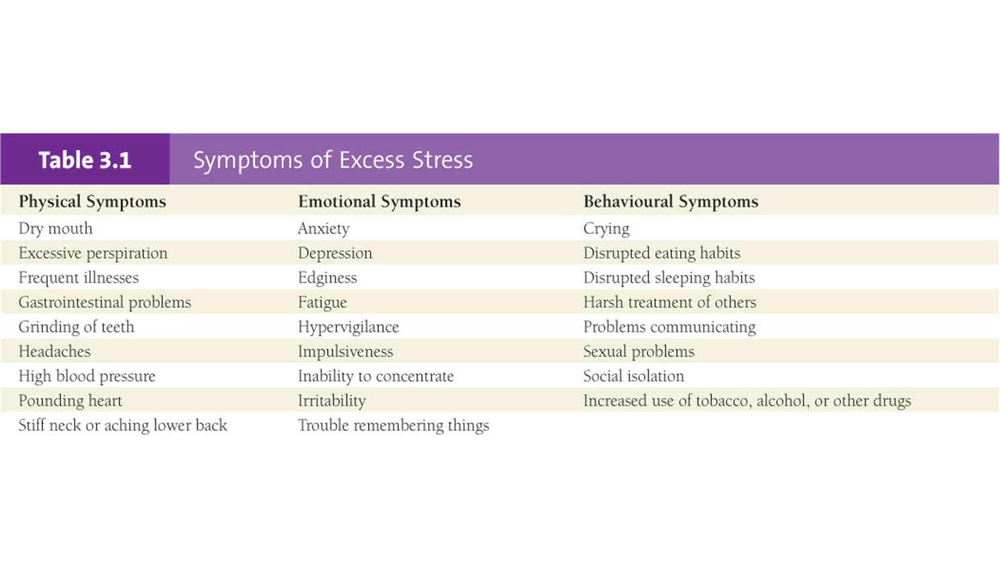

# Wellness Mind and Body Test Review Exam 1 (WEEK 2-5)

## Psychology Health 

    - the sum of how we think, feel, relate, and exist in life 
    - our thoughts, perceptions, emotions, motives, social, and behiours are  all part of psychology health

## Pyschology Health is...

    - how we think, feel and behave in ways that contribute to our life

## Maslows Hierarchy of Needs 

    - Pychology Needs 
        - Basic Needs Eveyone Deserves (Food, Water, Shelter, Sleep, Exercise, Sex)
    - Saftey and Security 
        - Feeling secure/safe with environment (people, location, self, Money)
    - Love and Belonging
        - Being loved or loving someone else, feeling a sense of connection with others
    - Self Esteem 
        - Gaining Confiedence in who you are from relationships and expirences 
    - Self Actualization 
        - Accepting who you are and being your true self 

## Eriksons Stages of Development 

    - Birth-1yo : Trust and Mistrust : Develop trust and comfort with people : Important People : Mom/Caregiver
    
    - 1-3yo : Autonomy vs Shame and Self Doubt : learning self control w/o losing the assertivness, exploration/locomotion : Parents 
    
    - 3-6yo : Initative vd Guilt : Finding a sense of purpose and initative; unresolved conflicts can lead to guilt : Child, Family

    - 6-12yo : Industry vd Inferiority : Developing skills; Success => leads to feeling compentant and industry; Failure => results in sense of inferiority : Peers, Role Models, Family 

    - 12-18yo : Identity vs Role Confusion : Finding who you are in society; Success => Clear sense of self; Failure => Confusion of Role in Society 

    - 18-40yo : Intimacy vs Isolation : Close, Meaningful Relationships; Success => develops intimate relationships ; Failure => becomes isolated : Friends, Partners

    - 40-65yo : Generativity vs Self-Absorption : Helps Well being of Future Gens; Success => accomplishment and generativity; Failure => sense of stagnation : Work Associates, Children, Community 

    - 65yo+ : Integraty vs Despair : Reflecting on life and accepting outcome; Success => sense of wisdom and acceptance; Failure =>  feelings of despair

## Growing Up Psychologically 
    - Begins in Adolesnce 
    - attitude, belief, ways of acting 
    - knowing who you are, capable of, what roles you play and place among peers 
    - Life long Process 

## Achieving A Healthy Self-Concept 

## Optimism vs Pessimism 
    - optimists tend to look on the more favorable side if situations and expect a positive outcome 
    - pessimist see negative aspects and expect negitive outcomes
    - pesimism is typically learned at young age 

## Dealing with Anger 
    - Can be benefical for mental health 

## Anxiety 
    - Another word for fear 
    - can be social, specific phobias (ex. Spiders, Heights), panic (random surges)

## Mood Disorders 
### Bipolar 
    - Alternating Mood swings // Depression -> Mania -> Happy 
    
### Schziophrenia 
    - Disorganized Thoughts 
    - Innapropriate Emotions 
    - Delusions 
    - Auditory Hallucinations 
    - Deteriorating social and work function 
### Suicide 
    - About 4500 Canadians die by suicide every year 
    
# WEEK 3 
# What is Stress 
    - adaptive response that is the consequence of any action 
    - can be a physical, mental or emotional response 

## Stressors 
    - Factors causing stress can be pleasant or unpleasant, real or imagined 
    - natural response of the body to any type of change to any new, threatning or exciting situation 

## Common Stressors 
    - major life changes 
    - daily hassles 
    - school/work 
    - social interactions 
    - violence 
    - natrual disasters 

## Reactions to Stress 
    - Eustress : Positive reaction to stress 
    - Distress : Negative reaction to stress 

## Fight 
    - Involves a confrontational and assertive reaction.
    - Individuals may stand up for themselves or their beliefs.
    - Increased adrenaline and readiness to engage in conflict.
## Flight 
    - Involves a tendency to avoid or escape a threatening situation.
    - Individuals may feel the urge to flee or distance themselves.
    - Activation of the "flight" response to evade perceived danger.
## Freeze
    - Involves a state of immobility or involuntary stillness.
    - Individuals may become temporarily paralyzed or unable to act.
    - Often triggered when a person feels overwhelmed or unable to escape.
## Fawn
    - Involves a people-pleasing and appeasing behavior.
    - Individuals may seek to cooperate and avoid conflict at any cost.
    - Adaptive strategy to gain social approval or reduce perceived threats.

## Managing stress 

    - activate your support system 
    - communicate what is stressing you 
    - develop healthy, exercise, eating, sleeping habits

 
### Strats 
    - Exercise : Natural way to relax and renew energy 
    - Relaxation tech: visualization, meditation, deep breathing, yoga, tai chi, music, meditaion 
    - Lifestyle changes : diet, alchol, drugs, relationships 
    -Reframing : reinteroreting the situation in a positive light 

### Counterproductive coping strats 
    - Not Enough Sleep 
    - Using Alchol or Drugs 
    - unhealthy eating habits 

## Mindfulness 
    - is the quality of attention we bring to the events in our lives 
    - paying attention to your expirence, on purpose, in the present moment, without judgement or criticism 

# WEEK 4 
# Eating For Wellness 
    - Food is associated with every dimension of wellness 
        - Physical
        - Emotional 
        - Interpersonal (Social)
        - Intellectual
        - Spiritual
        - Environmental 

## 6 Years of Eating 
    - you spend roughly 6 years of your life eating 
        - ~70,000 meals // 50 tons of food

## 6 Essential Nutrients 
    - carbs 
 

    - fat

    - protein 

    - vitamins / minerals 

    - fibre

    - water 
 

## Nutrient uses 
    Protien, carbs, and fats are used for energy, tissue repair and growth and regulates body processes

## Prioritize Plant Based foods
    - fruits, vegtables, grains, legumes 
    - plant based foods is rich in fibre, vitamins, and minerals and lower in cholesterol, calories, and saturated fats 
    - Avoiding Animal products with high saturated fat can reduce developing certain types of cancer 

## Food is Bio-Psycho-Social 
    - Biological - it fuels your body
    - Psychological – nourishes your mental state
    - Social – connects you with your culture and community
    
# WEEK 5 
## physcial Wellness
    - fitness levels and our ability to care for ourselves 
    - promotes proper care of our bodies fo optimal health and functioning 
    - connection between  physical wellness and mental health
## Why is it important to be fit?
    - easier to meet physcial demands of life 
    - positively responds to increased physical demands in stressful conditions 
    - withstand physical challenges and protects you from diseases

## 6 Components of Physical Fitness 
    - Cardiovascular Fitness : the capacity of the heart and lungs
    - Muscular Strngth :  the amount of force that a muscle can generate
    - Muscular Endurance : ability to resist fatigue 
    - Flexibility : ability to move joints through their full range of motion 
    - Body Composition : fat - fat-free mass proportions 
    - Skill Related components of fitness : ability to perform a specific skill (sports)

## Physical Activity and Exercise 
    - Levels of physcial activity remains low for all populations of Canadians 
    - Examples:     
        - Walking Dog
        - taking the stairs
        - moving our bodys throughout the day 

    - Exercise : 
        - typically planned and structured 
    
    - Only 36.2% of children and youth (5-17)  engage in regular physical activity 

## Exercise Guidlines 
    - At least 10 minutes of moderate-vigorous intensity aerobic exercise most days per week (a minimum of 150 minutes per week)
    
    - Strength training 2 days per week 
        - Strengthening exercises can also be referred to as resistance training. 
    
        - The resistance can come from workout machines, free weights or barbells, elastic bands, water or even your own body weight (e.g. push-ups).

## Examples of Moderate Amounts of Exercise
 

## 5 Benefits of Exercise 
    - Cardiorespitory function : improves  cardiovascular health, increases oxygen intake and reduces resting heart rate 
    - Metabolism : Efficiently generate energy from food 
    - Body Composition : Healthy body Composition  
    - Disease Prevention & Management  : Reduce risk factors for chronic disease such as heart disease, stroke, diabetes
    - Improved Psychology & Emotional Wellness : Reduced stress , anxiety, depression, improved self image, learning and memory, enjoyment, injury prevention 

## Addiction 
    - chronic loss of perspective of the role of exercise in a full life 
    - excessive time spent on exercise, leading to neglect of other aspects of health and wellbeing 

## Drugs affecting physical performance 
    - Steroids : used to build muscle and recover faster 
        - increased chance of heart  attack or stroke 
    - Amphetamines : taken to mask fatigue and enhance short term performance 
        - long term use linked to depression, anxiety, paranoia, psychosis, and suicide
    - Diuretics : often used to cause rapid weight loss 
        - can cause muscle cramping, heart arrhythmias, potassium deficiency 
        
# EXAM 2 REVIEW (WEEK 7-8)

# WEEK 7 - HEALTHY RELATIONSHIPS AND COMMUNICATION 
### Developing Close Relationships
---
- Willingness to give of oneself 
    - share ideas, feelings, time, needs - and to accept what others want to give 
- Self-Concept and Self-Esteem 
    - A positive self-concept and a healthy sense of self are essential for developing close relationships 
- Friendship Characteristics 
    - Companionship
    - Respect
    - Acceptance
    - Help
    - Trust
    - Loyalty
    - Mutuality
    - Reciprocity
### Love
---
- Love is one of the most basic and profound  human emotions 
    - can be characterized as authentic or inauthentic 

#### Authenic Love
- knowing the person
- caring for them
- respect
- dignity
- responsibility 
- growth, 
- commitment 
- trust 

#### Inauthentic Love 
- need to be in charge 
- rigid & unrealistic expectations 
- loves conditionally 
- untrusting 
- lacks commitment 
- manipulation 

#### The Triangle of Love 
- There are 3 dimensions of a loving relationship
    - Intimacy 
    - Passion 
    - Commitment 

##### Intimacy 
- Not about physical contact 
- it is about the emotional closeness 
- want us close to us to know our inner selves and to let us know theirs
- intimacy implies that people who are in a relationship care about each others happiness 

#### Passion 
- Often the first thing that springs to mind when we think about romance 
- Intensely positive feelings and desires for another person 
- may invole intense emotional, spiritual and intellectual attraction 

#### Commitment 
- the intention to remain with a reltionship 
    - commitment is not the same thing as love 
- decide based on the investments we put into the relationship 
- involes responsibility 
    - responsibilty of commitment are to make a relationship a priority, invest continously   

### Characteristics of Successful Romantic Relationships 
- Intimate Familiarity 
    - couples know each others goals, concerns and hopes 
- Fondness and Admiration
    - Once couples loses honour and respect for eachother it is hard to rekindle the relationship 
- Connectedness 
    - individuals honors each other
    - apprieciate others perspective 
- Shared Sense of Power 
    - when couples disagree, they look for common gorund (<strong>NOT</strong> my way or highway)
- Shared Goals 
    - partners incorporate each others goals into their concept of what their intimate relationships is about 
- Open Communication 
    - can talk with full honesty and openess about beliefs / morales 

### Challenges in Romantic Relationships 
--- 
- Honesty and openness 
- Unequal or premature commitment
- Unrealistic expectations
- Competitiveness
- Balancing time spent together and apart
- Jealousy
- Supportiveness 

### Pairing and Singlehood 
--- 
- The decision to <i>live together</i> in a common law or co-habitating relationship has become a social norm  
- Same sex relationships have similarities to hetrosexual relationships 
    - tend to be more equal (50/50) in decisions 

#### Singlehood 
- Number of singles is growing in Canada 
- Education and careers are delaying marriage 
- High divorce rates mean more singles 

### Marriage
---
- Benefits of marriage 
    - Affection
    - companionship 
    - sexual fulfillment 
    - emotional growth 
    - partnership 

### Family Life 
---
- Becoming a Parent 
    - martial satisfaction declines after fist born 

- Successful Families 
   - Commitment
   - Appreciation
   - Communication
   - Time together
   - Spiritual wellness
   - Coping with stress and crisis

### Separation and Divorce 
---
- Divorce is one of lifes greatest stressful events 
- Childern are especially vulnerable to trauma 

### Ending a Romantic Relationship 
--- 
- Give the relationship a fair chance before breaking up
- Be fair and honest
- Be tactful and compassionate
- If you are the rejected person, give yourself time to resolve your anger and pain
- Recognize the value in the experience

### Responses to Conflict 
--- 
#### Four Common response to Conflict 
1. Exit (aggresion)
    - active and destructive
    - leaving the rationship physically or psychologically 
2. Negelect (Passive Aggrestion)
    - passive and destructive 
    - minimizing or denying that conflict exists 
3. Loyalty (non-assertion)
    - passive and constructive 
    - remaining commited to the relationship 
    - choosing to put up with differences 
4. Voice (assertion) - <strong>Most Constructive Strategy</strong>
    - active and constructive 
    - activley seeking to talk openly about the conflict and resolving it 

### Signs That Could Indicate an Abusive Relationship 
--- 
- Verbal put downs
- Withholding love and affection
- Striking, hitting, pushing
- Using physical or psychological threats
- Making promises, yet never keeping them
- Unpredictable behaviour
- Extreme jealousy/possessiveness
- Chronic hostility and sarcasm

### Communication 
---
- Communication is the sending, receiving and understanding of messages 

#### 3  Key Elements for Effective Communication
- Self-disclosure 
- Listening 
- Feedback 
 
#### Self-Disclosure  
 - revealing personal information that you ordinarily wouldn’t reveal because of the  risk involved
 - friends often disclose the most to each other
 - married couples sometimes share less because they think they already know everything there is to know about each other

 #### Listening - <strong>Rare Skill</strong>
 - More time listening and trying to understand, less time judging, evaluating, blaming, advising or trying to control
 - to connect with other people and develop real intimacy, listening is essential. 
 
 #### Feedback 
 - a constructive response to a person’s self disclosure
 - giving positive feedback means acknowledging that the feelings are valid

#### Nonverbal Communication 
- 65-90% of communication is non verbal 
- the words we choose only account for 7% of our emotional impact on others.  
- 
- tone of voice accounts for 38% of the impact and 
- 
- facial expressions account for 55% of our emotional impact on others.  
    
# WEEK 8

# EXAM 3 REVIEW (WEEK 10-14)
# WEEK 10

# WEEK 11

# WEEK 12

# WEEK 13

# WEEK 14
